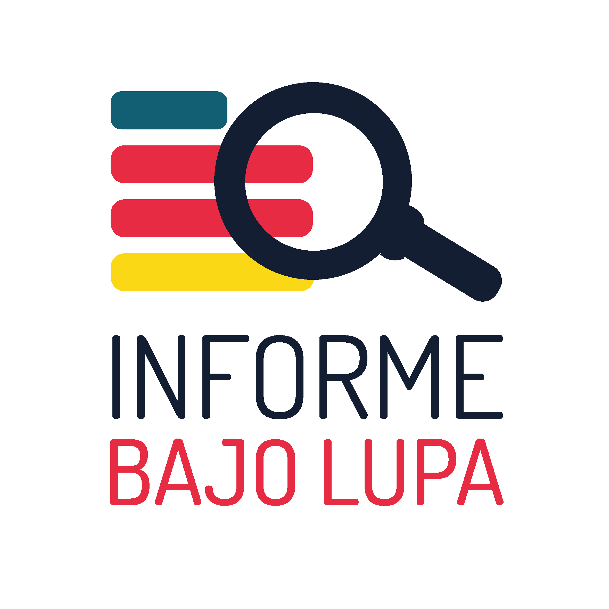

# Informe Bajo Lupa 

Informe Bajo Lupa es un ejercicio abierto y colaborativo entre personas, organizaciones y expertas, de revisión de los informes de gobierno locales en México. El objetivo es sentar, en un espacio abierto, durante un día, a cualquier persona de la sociedad civil a revisar la veracidad de los dichos de sus gobernantes a nivel municipio y estado ya que sus informes por lo general tienen menor verificación que el informe presidencial.

Nació en 2016 junto a varias organizaciones de la sociedad civil para fiscalizar los informes de los alcaldes de Guadalajara (Enrique Alfaro) y Zapopan (Pablo Lemus) y se replicó en 2017 para el informe del gobernador de Jalisco (Aristóteles Sandoval), y tres municipios del Estado de México (Naucalpan, Ecatepec y Tlalnepantla). 

En 2021 se actualizó la metodología para permitir un enfoque de trabajo totalmente en línea, y asíncrono.

El propósito de este repositorio es que cualquier grupo de personas que quiera replicar este ejercicio pueda encontrar aquí la metodología y herramientas necesarias para hacerlo.

## Recursos para organizar una edición

- [Manual del organizador](/docs/manual_organizador.md)
- [Manual para los participantes](/docs/manual_participantes.md)
- [Guía de buenas prácticas para particpar y verificar](guia_buenas_practicas.md)
- [Manual del moderador](/docs/manual_moderador.md)

## Tecnología

## Uso de la marca / Licencia o términos de uso
## Créditos

## Metodología

### Definir temáticas 
Definir temáticas relevantes a monitorear durante el infome (género, medio ambiente, violencia, etc.). Las temáticas determinarán las mesas de trabajo en las que se agruparán las personas para verificar y determinarán las personas expertas a invitar.

### Recopilación de dichos
Durante el informe de gobierno el grupo organizador recopila dichos relevantes por temática. Es importante recopilar dichos que incluyan datos verificables, no opiniones. Idealmente, en fuentes oficiales.  

### Verificación
Las participantes verifican cada dicho asíncronamente y le asignan una calificación: cierto, engañoso, hay otros datos. Se registra la fuente de datos que sustenta la calificación. Una vez que el dicho ha sido verificado por la persona, pasa a una segunda verificación con las expertas.

### Publicación y difusión
Con dos verificaciones se aprueba la publicación al sitio

-Equipo  
  Moderadores  
  Verificadores  
  Expertas  
-Guías  
  Moderación  
  Participación  

- Técnica  
- Uso de la marca  
- Créditos  
Tachi  
